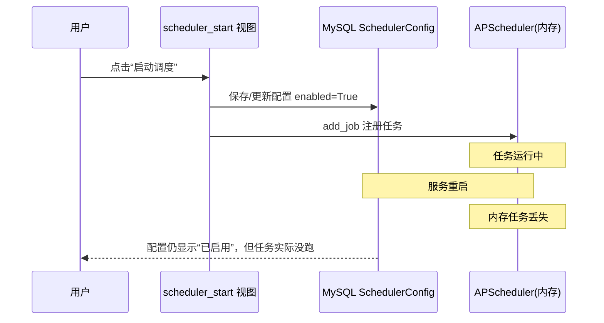
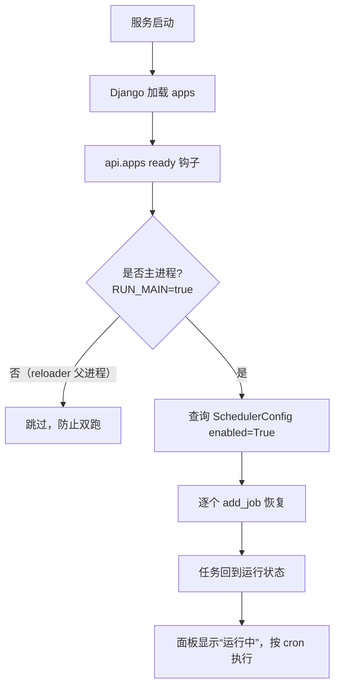

# 定时任务重启自动恢复 · 实现说明

> 关联功能：抖音热搜 / 微博热搜定时爬取调度
> 涉及文件：`tools/scheduler.py`、`api/apps.py`、`api/models.py`、`api/views.py`

## 一、问题背景

在页面的“定时调度”面板启动任务后，**只要重启开发服务器，任务就中断**，
面板显示“已停止”，需要手动再点一次“启动调度”。

### 原因

调度配置和调度任务本体存在两套存储里：

| 内容 | 存储位置 | 是否持久化 |
|---|---|---|
| 任务配置（`SchedulerConfig`：cron、启用状态、执行统计） | MySQL 数据库 | ✅ 持久化 |
| 任务本体（APScheduler 的 Job） | 进程内存（`MemoryJobStore`） | ❌ 重启即丢 |

服务重启后，数据库里的配置还在（`enabled=True`），但没有任何代码把它重新注册到
内存调度器，所以任务“名存实亡”。

## 二、原有机制（改造前）



## 三、修复方案：启动时自动恢复

核心思路：**服务启动时，扫描数据库里 `enabled=True` 的配置，把任务重新注册进调度器。**



## 四、关键实现

### 1. 恢复函数 `restore_jobs_from_config()`（tools/scheduler.py）

```python
def restore_jobs_from_config() -> int:
    if _skip_init:                      # 非主进程（reloader 父进程）直接跳过
        logger.info("跳过调度任务恢复（reloader/非主进程）")
        return 0

    from api.models import SchedulerConfig

    restored = 0
    for config in SchedulerConfig.objects.filter(enabled=True):
        try:
            scheduler_manager.add_job(
                job_id=config.task_id,      # 如 douyin_hot_crawler
                func=config.func_path,      # 如 "api.views._scheduled_crawl"
                cron_expr=config.cron_expr, # 如 "0 * * * *"
            )
            restored += 1
        except Exception as e:
            logger.error(f"恢复定时任务失败 {config.task_id}: {e}")
    return restored
```

关键点：

- `SchedulerConfig.objects.filter(enabled=True)` 只恢复用户已启动的任务；
  手动“停止调度”的任务 `enabled=False`，不会被恢复。
- `add_job` 支持“模块路径字符串”形式：内部 `rsplit(".", 1)` 后
  `importlib.import_module` + `getattr` 拿到函数，并用 `_close_db` 包装，
  防止任务执行后数据库连接泄漏。

### 2. 启动钩子 `ready()`（api/apps.py）

```python
class ApiConfig(AppConfig):
    ...
    def ready(self):
        # 服务重启后自动恢复数据库中已启用的调度任务
        from tools.scheduler import restore_jobs_from_config
        restore_jobs_from_config()
```

Django 在加载完所有应用后会自动调用每个 App 的 `ready()` 一次，
因此服务每次启动都会执行恢复逻辑，无需额外命令。

### 3. 主进程判断 `_skip_init`

开发服务器 `runserver` 是父子双进程结构：

```python
_skip_init = os.environ.get("RUN_MAIN") != "true"
```

| 进程 | RUN_MAIN | 是否恢复任务 |
|---|---|---|
| 父进程（文件监听 reloader） | 未设置 | 跳过 |
| 子进程（真正处理请求） | `"true"` | 恢复任务 |

这个判断保证任务只注册一次，不会父子进程双跑。

## 五、完整运行流程

1. 用户在页面点击“启动调度” → `scheduler_start` 视图：保存配置（`enabled=True`）、
   `scheduler_manager.start()`、`add_job` 注册任务
2. 服务运行期间按 cron 执行；`_scheduled_crawl()` 每次执行后把结果写回
   `SchedulerConfig`（上次执行时间 / 结果 / 次数）
3. **服务重启** → Django 加载应用 → `ApiConfig.ready()` → 查询 `enabled=True`
   的配置 → 逐个 `add_job` 恢复 → 任务继续按 cron 运行
4. 页面轮询 `/api/scheduler/status/`，面板显示“运行中”和下次执行时间

## 六、验证结果

实测（2026-08-03）：

```
DB 中已启用任务: [('douyin_hot_crawler', '0 * * * *'), ('weibo_hot_crawler', '0 * * * *')]
恢复任务数: 2
当前调度器任务: [('douyin_hot_crawler', '2026-08-03 20:00:00'), ('weibo_hot_crawler', '2026-08-03 20:00:00')]
```

两个热搜任务重启后自动恢复，下次执行时间正确。

## 七、局限与生产建议

1. **适用范围**：恢复机制基于单进程假设（开发 runserver 子进程）。
2. **多 worker / 多机部署**：gunicorn 多 worker 各自启动调度器会导致任务重复执行，
   此时应禁用页面内调度，改用外部调度（systemd timer / Celery Beat / K8s CronJob）
   触发管理命令 `python manage.py crawl_douyin` / `crawl_weibo`。
3. **APScheduler 本身**仍用 `MemoryJobStore`，任务不会跨进程共享；
   恢复逻辑只是“配置 + 启动时重注册”的轻量方案，符合当前单机场景。

## 八、涉及文件

| 文件 | 作用 |
|---|---|
| `tools/scheduler.py` | 调度器单例、`add_job`、`restore_jobs_from_config` |
| `api/apps.py` | `ready()` 启动钩子，触发恢复 |
| `api/models.py` | `SchedulerConfig`（任务配置持久化） |
| `api/views.py` | `scheduler_start/stop/status` 视图，`_scheduled_crawl` 执行函数 |
