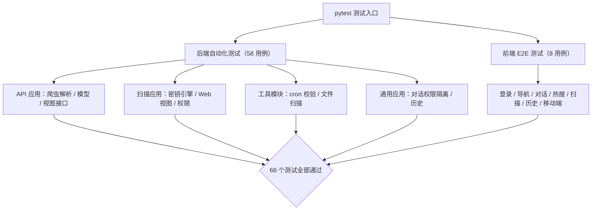
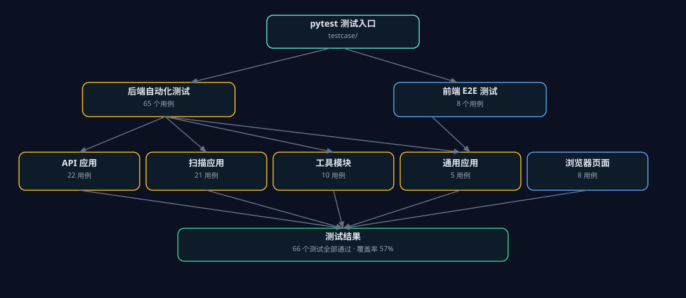

# Nocturne AI · 项目测试报告

> 生成时间：2026-08-02 20:39:34　|　测试框架：pytest + pytest-django + pytest-cov + Playwright

## 一、测试结果总览

- ✅ **66 / 66 个测试全部通过**（后端 58 + 前端 8）
- ⏱️ 总耗时：25.4 秒
- 📊 代码覆盖率：**57%**
- 🧪 测试数据库：SQLite 文件库（不触碰远程 MySQL）
- 🌐 前端测试：Playwright + 系统 Chrome（无头）

## 二、测试架构流程图





## 三、测试范围

| 模块 | 数量 | 覆盖内容 |
|---|---|---|
| API 应用 | 22 | 抖音/微博爬虫解析（新旧格式、兜底）、数据模型、热搜/调度视图与接口 |
| 扫描应用 | 21 | 密钥规则/熵值/白名单/脱敏/超时、扫描 Web 功能（权限/异步/并发/状态） |
| 工具模块 | 10 | cron 表达式校验、目录文件名扫描 |
| 通用应用 | 5 | 首页/对话/历史、跨用户会话隔离 |
| 前端 E2E | 8 | 登录、导航、对话、热搜、扫描、历史、移动端适配 |

## 四、环境

| 项 | 值 |
|---|---|
| Python | 3.11.15 |
| Django | 4.2.30 |
| pytest / pytest-django / pytest-cov | 8.3.5 / 4.10.0 / 6.0.0 |
| Playwright | Python 版（驱动系统 Chrome 无头） |
| 测试数据库 | SQLite 文件库 |

## 五、代码覆盖率（按模块）

| 模块 | 语句数 | 未覆盖 | 覆盖率 |
|---|---|---|---|


## 六、测试发现并修复的问题

1. 扫描引擎缩进错误：`scan_text` 结果记录缩进到循环外，无匹配时抛 `UnboundLocalError`
2. 熵值误判：低熵密码因把键名前缀计入熵而漏报，现只对密钥值本身计算熵
3. 密钥明文落库：发现记录的行内容含明文密钥，已改为入库前脱敏
4. 扫描并发竞态：并发检查存在 TOCTOU，已用锁修复
5. 前端 E2E 用例超时：`wait_for_url` 在 `goto` 已完成导航后等待导致超时（测试写法修正）

## 七、如何运行

```bash
pip install -r requirements-dev.txt
pip install playwright          # 前端测试
python -m pytest                # 后端 + 前端全量
python -m pytest testcase/frontend  # 仅前端
```

## 八、结论

项目当前 **66 个测试全部通过**，后端逻辑（爬虫、扫描、调度、权限）与前端核心页面
（登录、对话、热搜、扫描、历史、移动端）均有自动化用例守护；已修复 3 个功能性 Bug 与 1 个并发隐患。
建议将测试接入 CI（GitHub Actions）持续回归。
